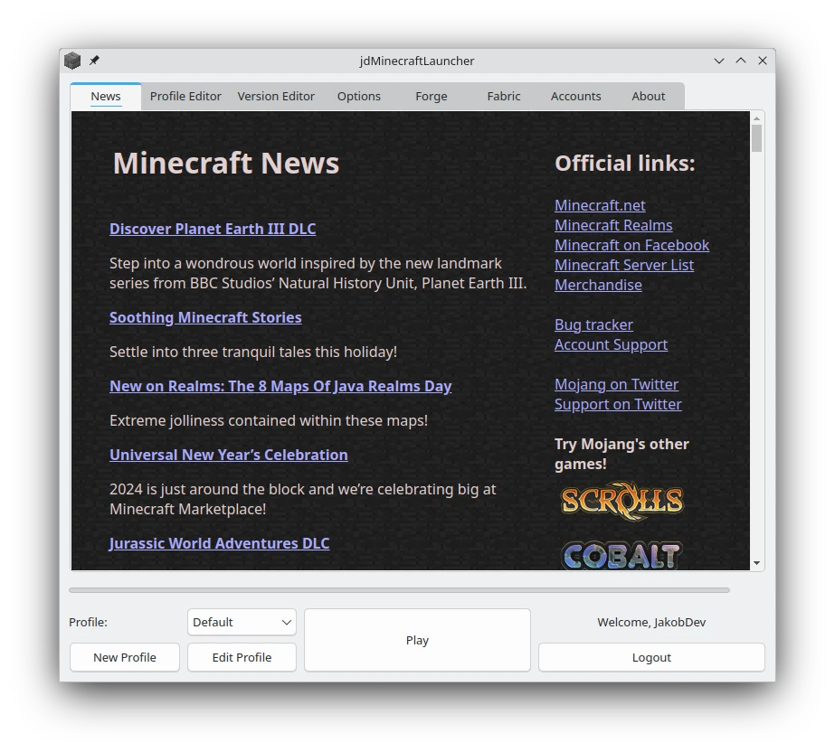

<h1 align="center">jdMinecraftLauncher</h1>

<h3 align="center">Unofficial classic styled Minecraft Launcher</h3>

<p align="center">
    
</p>

jdMinecraftLauncher is a Minecraft launcher which Look and Feel is close to the the good old official Launcher

Features:

- All Minecraft versions are supported
- Offline mode is available after your first login
- One click install of Forge and Fabric
- FeralInteractive GameMode is supported
- Create Shortcuts in the Menu and on the Desktop to directly launch Minecraft
- For Developers commandline arguments and a D-Bus Interface are provided
- Profiles can be imported from the vanilla launcher

You need a Microsoft Account which owns Minecraft to use this Launcher

This Launcher is completly fanmade and not supported by Mojang/Microsoft
## Install

### Flatpak
You can get jdMinecraftLauncher from [Flathub](https://flathub.org/apps/details/page.codeberg.JakobDev.jdMinecraftLauncher)

### AUR
Arch Users can get jdMinecraftLauncher from the [AUR](https://aur.archlinux.org/packages/jdminecraftlauncher)

### Sourceforge
You can get Windows and AppImage Builds from [Sourceforge](https://sourceforge.net/projects/jdMinecraftLauncher)

### pip
You can install jdMinecraftLauncher from [PyPI](https://pypi.org/project/jdMinecraftLauncher) using `pip`:
```shell
pip install jdMinecraftLauncher
```
Using this Method, it will not include a Desktop Entry or any other Data file, so you need to run jdMinecraftLauncher from the Command Line.
Use this only, when nothing else works.

#### From source
This is only for experienced Users and someone, who wants to package jdMinecraftLauncher for a Distro.
jdMinecraftLauncher should be installed as a Python package.
You can use `pip` or any other tool that can handle Python packages.
You need to have `lrelease` installed to build the Package.
After that, you should run `install-unix-datafiles.py` which wil install things like the Desktop Entry or the Icon in the correct place.
It defaults to `/usr`, but you can change it with the `--prefix` argument.
It also applies the translation to this files.
You need gettext installed to run `install-unix-datafiles.py`.

Here's a example of installing jdMinecraftLauncher into `/usr/local`:
```shell
sudo pip install --prefix /usr/local .
sudo ./install-unix-datafiles.py --prefix /usr/local
```

## Translate
You can help translating jdMinecraftLauncher on [Codeberg Translate](https://translate.codeberg.org/projects/jdMinecraftLauncher)


## Develop
jdMinecraftLauncher is written in Python and uses PyQt6 as GUI toolkit. You should have some experience in both.
You can run `jdMinecraftLauncher.py`to start jdMinecraftLauncher from source and test your local changes.
It ships with a few scripts in the tools directory that you need to develop.

#### CompileUI.py
This is the most important script. It will take all `.ui` files in `jdMinecraftLauncher/ui` and compiles it to a Python class
and stores it in `jdMinecraftLauncher/ui_compiled`. Without running this script first, you can't start jdMinecraftLauncher.
You need to rerun it every time you changed or added a `.ui` file.

#### BuildTranslations.py
This script takes all `.ts` files and compiles it to `.qm` files.
The `.ts` files are containing the translation source and are being used during the translation process.
The `.qm` contains the compiled translation and are being used by the Program.
You need to compile a `.ts` file to a `.qm` file to see the translations in the Program.

#### UpdateTranslations.py
This regenerates the `.ts` files. You need to run it, when you changed something in the source code.
The `.ts` files are contains the line in the source, where the string to translate appears,
so make sure you run it even when you don't changed a translatable string, so the location is correct.

####  UpdateUnixDataTranslations.py
This regenerates the translation files in `deploy/translations`. these files contains the translations for the Desktop Entry and the AppStream File.
It uses gettext, as it is hard to translate this using Qt.
These files just exists to integrate the translation with Weblate, because Weblate can't translate the Desktop Entry and the AppStream file.
Make sure you run this when you edited one of these files.
You need to have gettext installed to use it.
